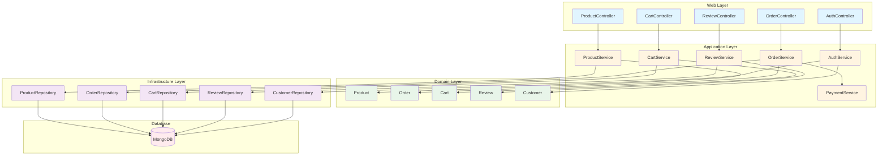
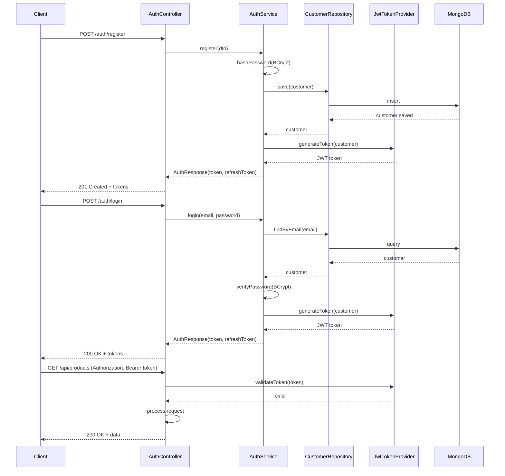
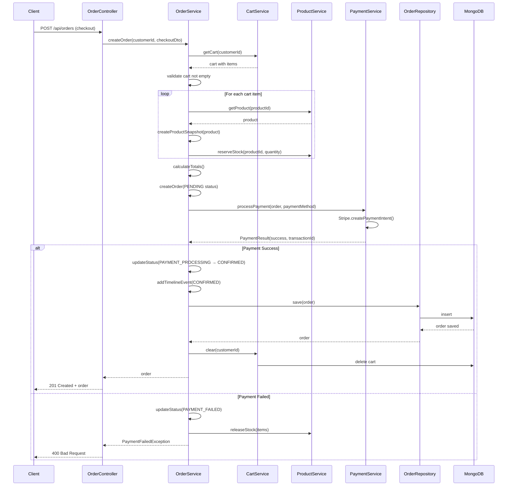
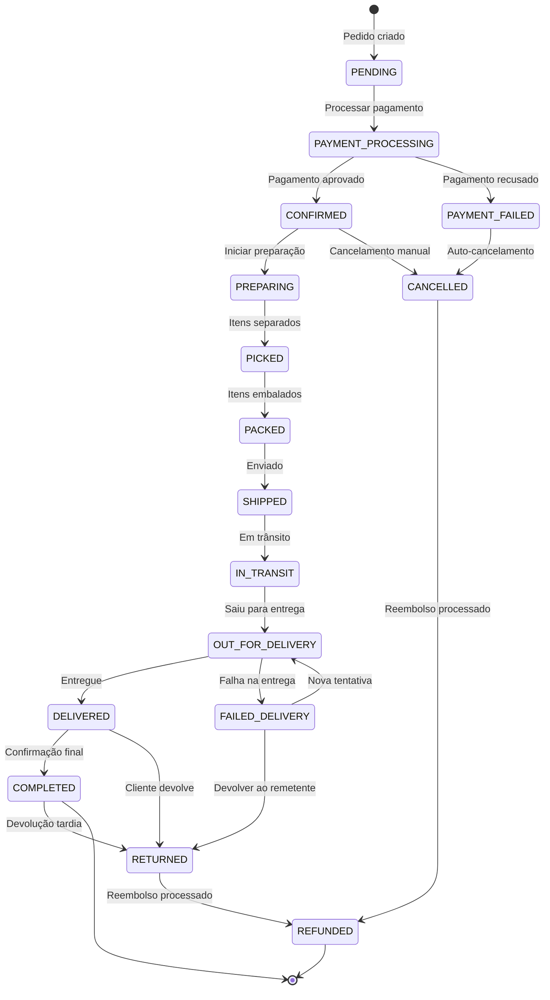
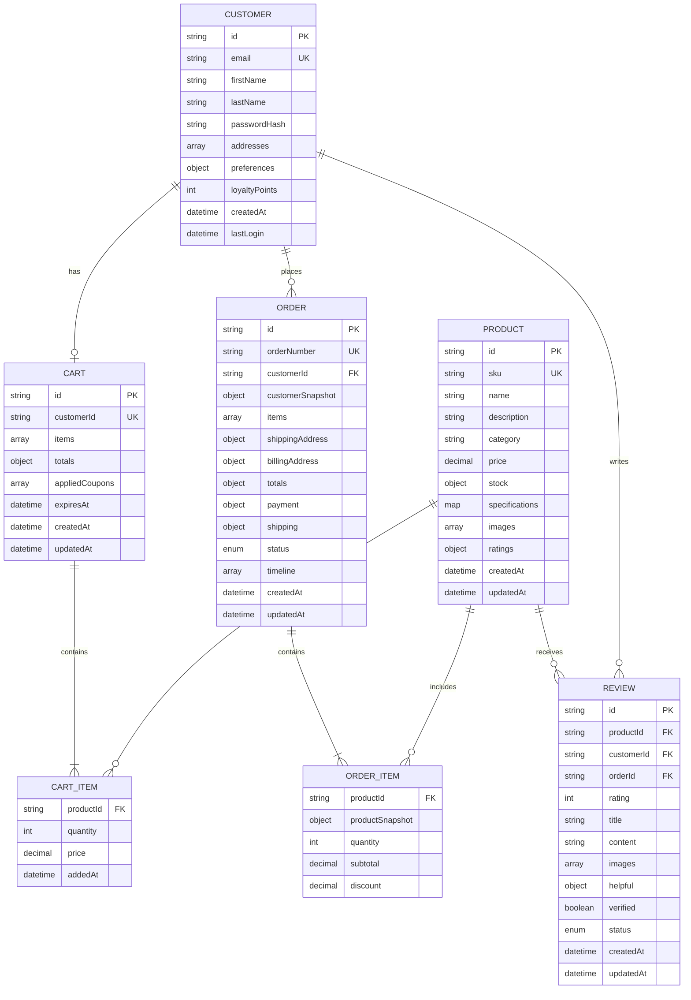
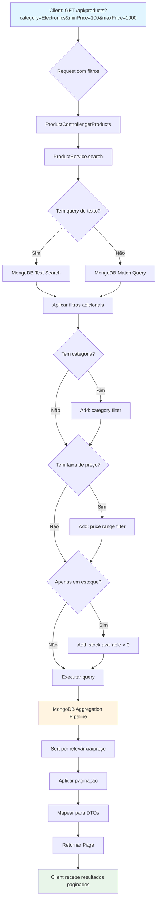
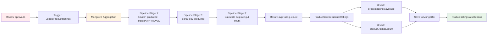
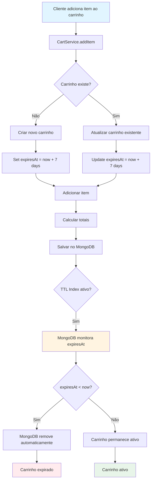
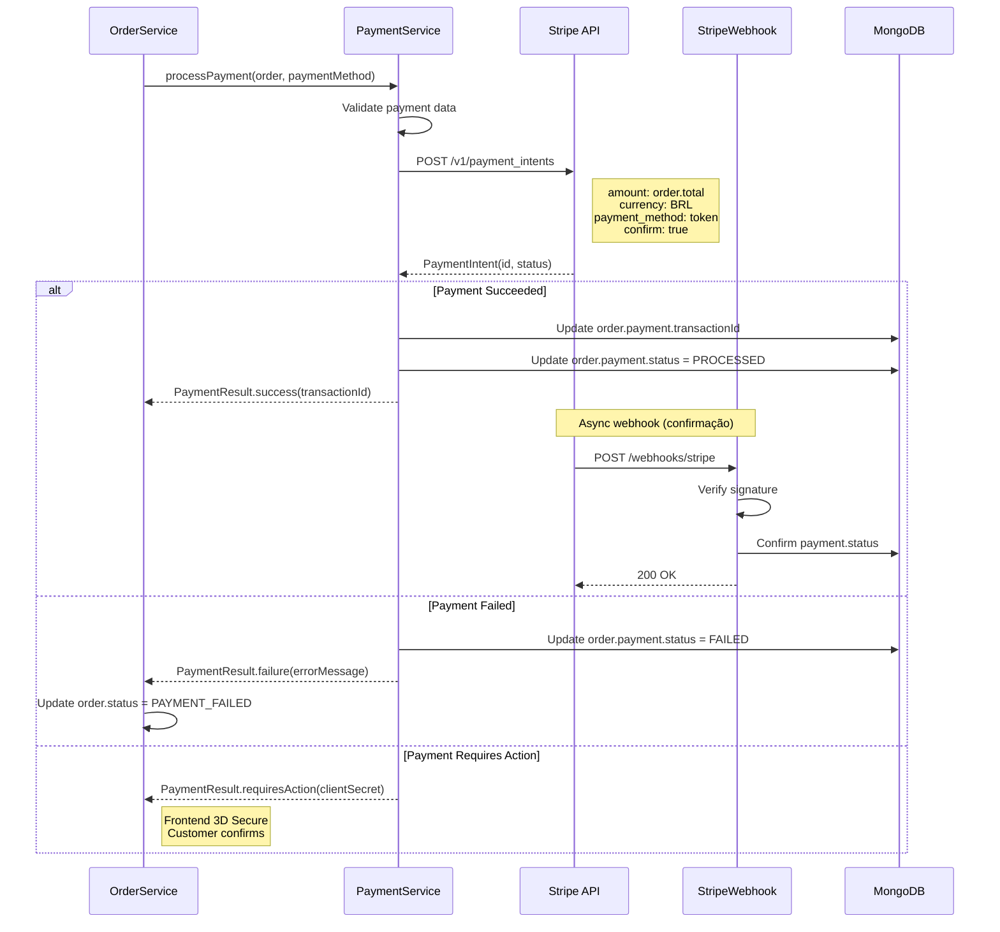
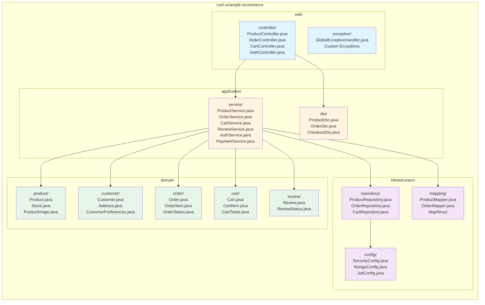

# Diagramas de Arquitetura - E-commerce API

Este documento contém os diagramas de arquitetura do sistema em formato Mermaid.

---

## 1. Arquitetura em Camadas (DDD)

---

## 2. Fluxo de Autenticação JWT

---

## 3. Fluxo de Criação de Pedido (Checkout)

---

## 4. Máquina de Estados do Pedido

---

## 5. Modelo de Dados MongoDB (ER Diagram)

---

## 6. Fluxo de Busca de Produtos com Filtros

---

## 7. Agregação de Ratings de Reviews

---

## 8. Sistema de Carrinho com TTL

---

## 9. Integração com Gateway de Pagamento (Stripe)

---

## 10. Estrutura de Pacotes DDD

---

**Documento criado:** 4 de dezembro de 2025  
**Versão:** 1.0  
**Formato:** Mermaid Diagrams
